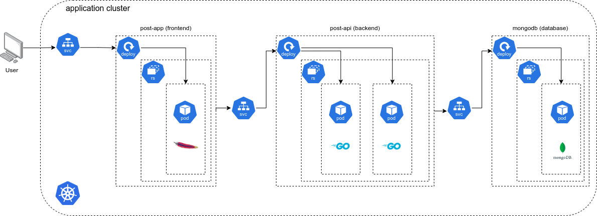

# k8s-cluster-example
Local Kubernetes cluster example with a simple webapp.

</img>

## What you need?
[`docker`](https://docs.docker.com/engine/install/) and [`minikube`](https://minikube.sigs.k8s.io/docs/start/). A standalone [`kubectl`](https://kubernetes.io/docs/reference/kubectl/) installation is not needed. Please review `minikube` resource requirements before installation.

## Deploying the cluster locally
You don't need to build the [`backend`](./back/post-service) and [`frontend`](./front/post-app) application images to spin up the cluster, as they are publicly available on Docker Hub. To start the cluster, first spin `minikube`:

```sh
minikube start
```

For ease of usage, define an alias to use the internal `kubectl` that `minikube` provides:
```sh
alias kubectl="minikube kubectl --" # on .bashrc or similar
```

Now you can directly deploy all manifest files:
```sh
kubectl apply -f infra/
```

Retrieve the workload status with:
```sh
kubectl get pod,rs,deploy,svc,configmaps
```

Once the deploy finishes, you can access the frontend application by opening a tunnel:
```sh
minikube service post-app-service --url
```

Check [`docs/tutorial.md`](./docs/tutorial.md) for a step-by-step implementation.

## Notice
All rights reserved Adobe Systems Incorporated for [Source Code Pro](https://fonts.google.com/specimen/Source+Code+Pro) font. The original font license can be read [here](./front/post-app/src/assets/OFL.txt). The font was downloaded from https://fonts.google.com/specimen/Source+Code+Pro.

## Resources

- https://www.edx.org/learn/kubernetes/the-linux-foundation-introduction-to-kubernetes
- https://kubernetes.io/docs/concepts/
- https://blog.andreaskrahl.de/tag/introduction-to-kubernetes/
- https://minikube.sigs.k8s.io/docs/start/
